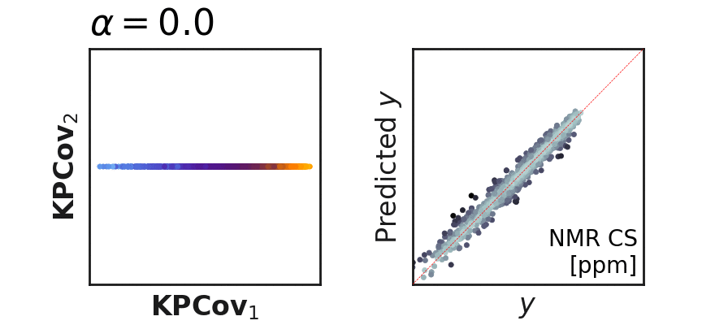

# Summary

`scikit-COSMO` (`skcosmo`) focuses on machine learning methods that are actively used, for example, in the field of computational materials science and chemistry. Currently, many
machine learning studies employ the foundational `scikit-learn` repository, a
collection of widely applicable machine learning algorithms and methods.
Written in the same language (Python), style, and adhering to the same guidelines, we aim to provide
users the ability to seamlessly include methods tailored for material science in machine learning
workflows alongside those from `scikit-learn`.

# Statement of need

While machine learning algorithms are fully general and can be applied to a wide variety of fields, the relative importance of different aspects of machine learning workflows can vary wildly between disciplines. The `skcosmo` package thus provides machine learning algorithms developed to meet the specific needs of those who use machine learning to understand or represent collections of atoms or molecules, where there is increased emphasis on the representation of physical entities---namely, atoms, their connectivity, or their relative orientation in space---in a numerical format compatible with machine learning pipelines, known as the _featurization_. This emphasis stems from both the variety of available featurization techniques and from the expanse of tunable hyperparameters within each technique, necessitating methods for comparing featurizations, removing redundant features, or condensing features. Currently, `skcosmo` contains algorithms developed by the Laboratory of Computational Science and Modeling (COSMO) to address these specific problems, the open-source implementation of which were all previously unavailable.

- Feature Reconstruction Measures[@Goscinski2021] - both global and local measures
to describe the linearly decodable information of one representation by another one.
This set of unsupervised algorithms is of particular use in quantifying the effect
of hyperparameters on representations.

    
    **Fig. 1. A sketch of the different feature reconstruction measures** with two manifolds describing the same dataset for two different sets of three features. The reconstructions describe mappings of the squared manifold onto the curved manifold. The linear reconstruction scales the feature dimensions in different intensities. The orthogonal reconstruction is used to describe such strong divergent scalings between feature dimensions in the linear mapping. The local reconstruction linearly maps the local environment defined by the number of neighbours around each point. While a global linear reconstruction cannot capture the curvatures, a locally linear reconstruction for each datapoint can.

- Hybrid Supervised-Unsupervised Dimensionality Reduction and Regression[@deJong1992, @Helfrecht2020] - linear and
non-linear techniques to combine features into latent-space projections
(similar to PCA) that also incorporate target information. This is of particular
use when condensing features prior to property regression or constructing
structure-property maps, such as those analyzable via[@Fraux2020]. In Kernel Principal Covariates Regression (KPCovR), a mixing parameter `\alpha` interpolates
between kernel ridge regression (`\alpha=0`) and kernel principal
components analysis (KPCA, `\alpha=1`). An example of KPCovR on a
dataset of small molecules and their NMR chemical shieldings is shown in Fig. 2.

    
    **Fig. 2. The evolution of latent-space projections and regressions as the mixing parameter `\alpha` goes from 0 to 1 in Kernel PCovR.** In the left panel, the projection is plotted across the first two kernel principal covariates, with color indicating the property of interest (here NMR Chemical Shieldings from [@Ceriotti2019]). In the right panel, the comparison of the target property with that predicted using the latent space projection (color denotes error from target).

- Feature and Sample Selection[@Imbalzano2018, @Cersonsky2021] - methods focused on determining
a diverse or information-rich subset of features or samples for machine
learning problems.

scikit-COSMO also contains minimal datasets used to test the implementation, including a small subset of molecules and their NMR chemical shieldings, as reported in [@Ceriotti2019]. As a note, `skcosmo` itself does not compute atomic descriptors directly, and instead takes as input descriptors computed by prominent software such as `librascal` [@Musil2021], `QUIP`[@quip], and `DScribe`[https://github.com/SINGROUP/dscribe].

# Acknowledgements

We acknowledge contributions from the entire COSMO team, particularly
Giulio Imbalzano and Max Veit.

# References
